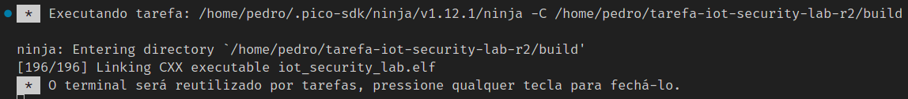
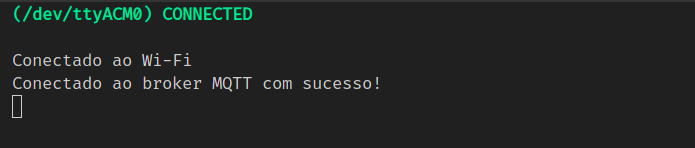
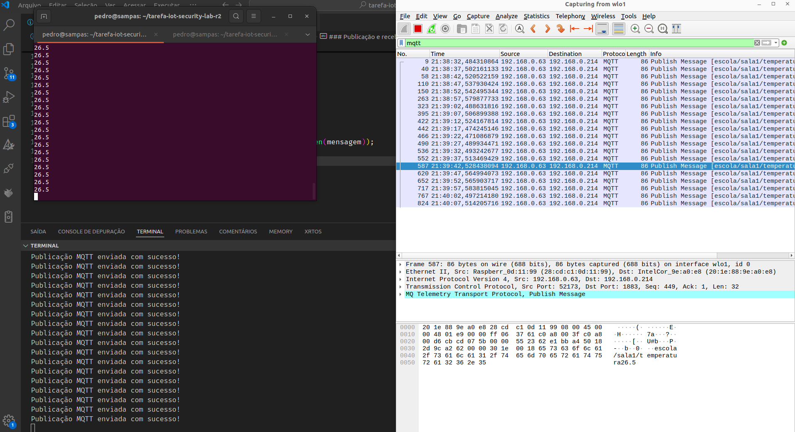
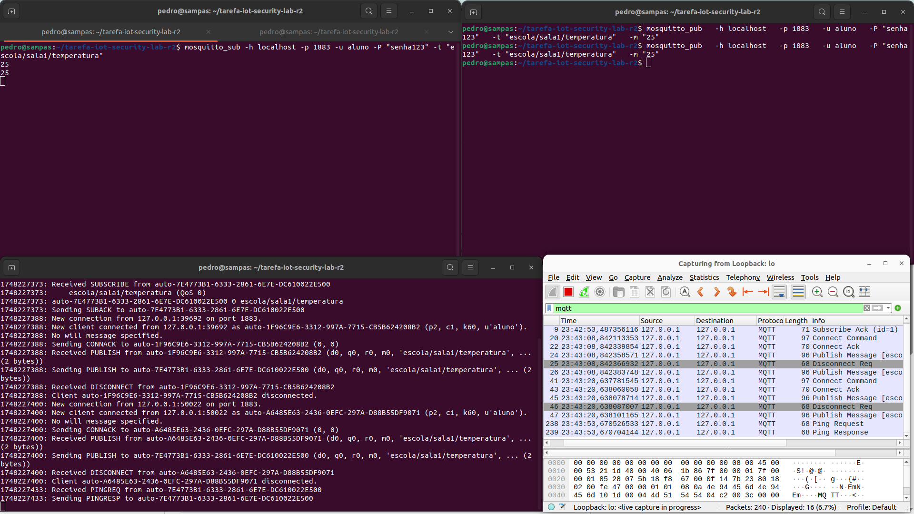
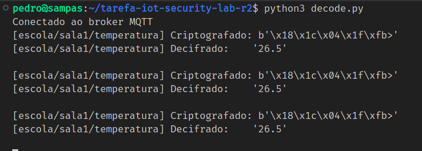
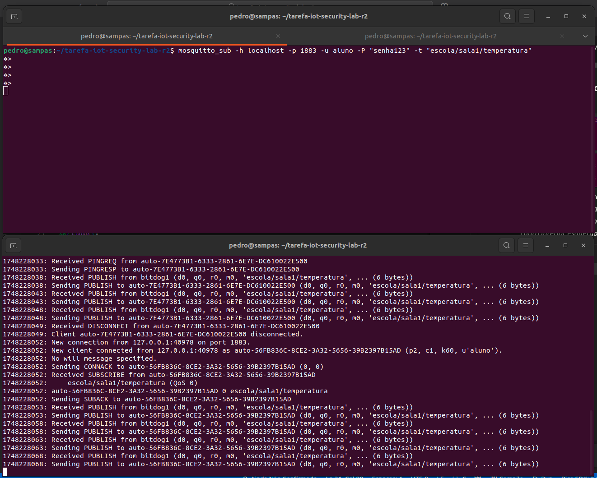
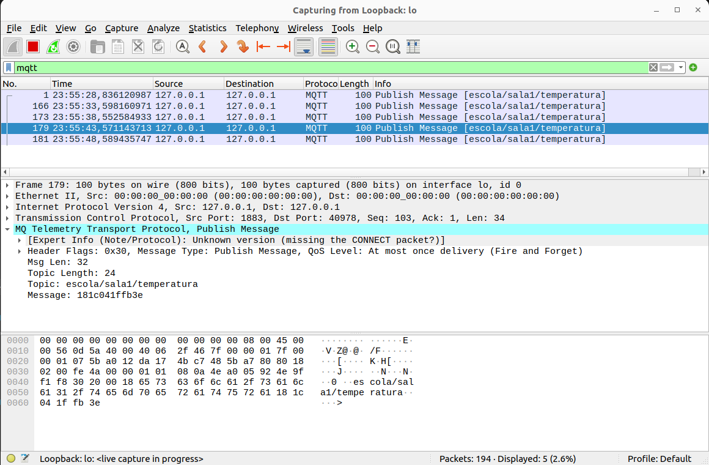
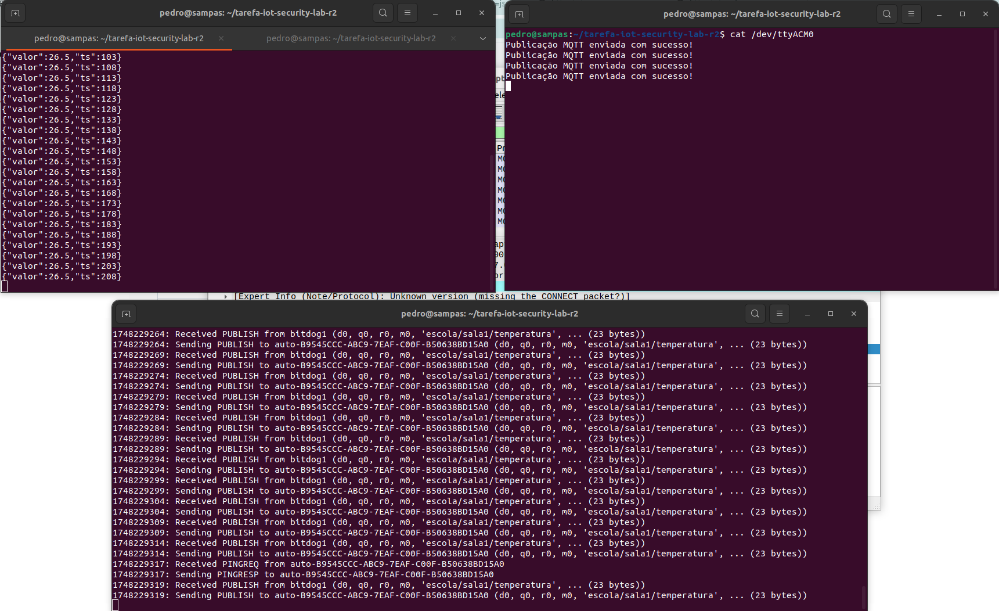

[](https://classroom.github.com/a/G8V_0Zaq)

# Tarefa: IoT Security Lab - EmbarcaTech 2025

Autores: **Andre de Oliveira Melo e Pedro Sampaio Dias**

Curso: Residência Tecnológica em Sistemas Embarcados

Instituição: EmbarcaTech - HBr

Brasília, maio de 2025

---

# Instalação e configuração do Mosquitto

Este guia mostra, passo a passo, como instalar e configurar o broker MQTT Mosquitto no Ubuntu, tanto em modo aberto (sem autenticação) quanto com usuário e senha e TLS.

---

## 1. Atualizar repositórios e instalar pacotes

Abra um terminal e execute:

```bash
sudo apt update
sudo apt install -y mosquitto mosquitto-clients
```
- mosquitto: o broker MQTT

- mosquitto-clients: traz os clientes mosquitto_pub e mosquitto_sub

## 2. Habilitar e iniciar o serviço

```bash
sudo systemctl enable mosquitto
sudo systemctl start mosquitto
```
Verifique o status:

```bash
sudo systemctl status mosquitto
```

## 3. Escutar teste básico (modo aberto)

Mostra todos os IP's:

```bash
ip addr | grep 'inet ' | awk '{print $2}' | cut -d/ -f1
```

Escutar no localhost ou IP específico:

```bash
mosquitto_sub -h localhost -t "escola/sala1/temperatura"
```

## 4. Habilitar autenticação por usuário e senha

### 4.1 Desabilitar conexões anônimas
Crie (ou edite) um arquivo de configuração em /etc/mosquitto/conf.d/auth.conf:

```bash
allow_anonymous false
password_file /etc/mosquitto/passwd
listener 1883
```

### 4.2 Criar arquivo de senhas
Adicione um usuário:

```bash
sudo mosquitto_passwd -c /etc/mosquitto/passwd meu_usuario
```

### 4.3 Reiniciar o serviço para aplicar mudanças

```bash
sudo systemctl restart mosquitto
```
# Relatório das etapas

## Conectando ao Wifi e Setup MQTT (Etapa 1 e 2)

### Compilado com sucesso: 

  
*O código foi compilado corretamente, sem erros de sintaxe ou dependências faltando.*

### Wifi e MQTT conectado: 

  
*O dispositivo estabeleceu conexão com a rede “WiFi-Pedro” e registrou-se no broker MQTT sem problemas, como é possível ver no print da saída serial.*  

```c
// Conecta à rede WiFi
// Parâmetros: Nome da rede (SSID) e senha
connect_to_wifi("WiFi-Pedro", "@09090909@");

// Configura o cliente MQTT
// Parâmetros: ID do cliente, IP do broker, usuário, senha
mqtt_setup("bitdog1", "192.168.0.214", NULL, NULL);
```
## Publicação MQTT sem segurança (Etapa 3)

### Publicação e recebimento do pacote MQTT

  
*No terminal, esquerda superior, é exibido o valor recebido em texto não criptografado. No canto inferior esquerdo, a saída serial da BitDogLab apresenta a publicação realizada. À direita, o Wireshark captura os pacotes MQTTS, mostrando timestamp, endereço de origem, endereço de destino, protocolo e o tópico MQTT (escola/sala1/temperatura).*  

```c
// Mensagem original a ser enviada
const char *mensagem = "26.5";

// Publica a mensagem original (não criptografada)
mqtt_comm_publish("escola/sala1/temperatura", mensagem, strlen(mensagem));
```

## Publicação MQTT com segurança (Etapa 4)

### Arquivo *.conf do Mosquitto

```bash
>> /etc/mosquitto/conf.d/bind.conf                   
listener 1883 0.0.0.0
allow_anonymous false
password_file /etc/mosquitto/passwd
```
### Teste de autenticação no Mosquitto

  
*Na parte superior esquerda do terminal, é exibido o valor recebido em texto plano (sem criptografia). No canto inferior esquerdo, aparece o log do servidor MQTT com o modo verbose ativado. No canto superior direito, são mostradas as mensagens publicadas, e no Wireshark observa-se a captura dos pacotes MQTTS.* 

## Simulando criptografia leve - XOR (Etapa 5)
 
*Visualização no terminal da mensagem cifrada e decifrada utiilzando XOR*
  
*Visualização do broker no terminal*
 
*Visualização dos pacotes no wireshark*

## Proteção contra replay (Etapa 6)
 
*Os terminais na parte superior da tela mostram à esquerda a mensagem recebida com timestamp e à direita a "bitdoglab1" publicando. Já na parte inferior, temos a "bitdoglab2" que atua como publisher e subscriber, recebendo as mensagens da outra placa, com timestamp*

## Etapa Final - relato e análise

### Quais técnicas são escaláveis?

**Autenticação:** Cada BitDogLab recebe identidade única na configuração do broker, para permitir apenas dispositivos autenticados e melhorar a rastreabilidade

**Tópicos MQTT hierárquicos:** Estrutura como `escola/sala/bancada/dispositivo` permite gerenciar vários dispositivos de forma organizada.

**Criptografia ChaCha20-Poly1305:** Leve e eficiente, funciona bem mesmo com centenas de dispositivos com poder limitado de processamento.

**Proteção anti-replay com timestamps:** Cada mensagem tem prova própria de autenticidade, sem estados compartilhados complexos.

### Como aplicá-las com várias BitDogLab em rede escolar?

**Infraestrutura:**
- Servidores locais (BitDogLab) como publishers e subscribers
- Redes Wi-Fi segmentadas por função (básica/avançada/demo)
- Broker MQTT central com rate limiting, QoS e como Autoridade Certificadora

**Gerenciamento:**
- Dashboard web para monitorar todos os dispositivos
- Provisionamento automático de novos dispositivos
- Rotação de chaves programada para fins de semana
- Logs centralizados para detectar anomalias

**Implementação:**
- Iniciar com laboratório piloto
- Expandir gradualmente após validação
- Treinar equipe técnica nos procedimentos
- Documentar troubleshooting comum

Esta abordagem permite crescer de poucos dispositivos para centenas mantendo segurança e facilidade de gerenciamento.

